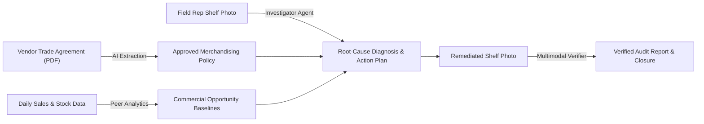

# StoreOps · Product & User Handbook

Welcome to **StoreOps**, the autonomous retail operations intelligence platform. This handbook is written for business leaders, retail operations teams, brand merchandisers, and field sales representatives. It explains what StoreOps is, why it was created, how it works, and how to use it to optimize in-store execution and protect trade investment.

---

## Table of Contents
1. [Executive Summary: What is StoreOps?](#1-executive-summary-what-is-storeops)
2. [Why We Built StoreOps: The Retail Execution Gap](#2-why-we-built-storeops-the-retail-execution-gap)
3. [Key Benefits & Value Proposition](#3-key-benefits--value-proposition)
4. [Who Uses StoreOps? (User Roles & Personas)](#4-who-uses-storeops-user-roles--personas)
5. [Core Concepts Explained Simply](#5-core-concepts-explained-simply)
6. [Step-by-Step User Guides](#6-step-by-step-user-guides)
   - [For Operations Leads & Admins: Setup, Ingestion & Policy Approval](#for-operations-leads--admins-setup-ingestion--policy-approval)
   - [For Field Representatives & Merchandisers: Conducting a Store Audit](#for-field-representatives--merchandisers-conducting-a-store-audit)
7. [Understanding What You See on Screen (UI & Metric Guide)](#7-understanding-what-you-see-on-screen-ui--metric-guide)
8. [Why You Can Trust StoreOps: Grounding & Anti-Hallucination](#8-why-you-can-trust-storeops-grounding--anti-hallucination)
9. [Frequently Asked Questions (FAQ)](#9-frequently-asked-questions-faq)

---

## 1. Executive Summary: What is StoreOps?

**StoreOps** is an autonomous intelligence platform designed to eliminate the disconnect between **trade promotion contracts**, **point-of-sale (POS) data**, **warehouse supply chains**, and **physical store shelves**.

By pairing multimodal artificial intelligence (powered by Google Gemini) with real-time operational telemetry, StoreOps:
- Ingests complex legal retail vendor agreements and automatically translates them into clear merchandising rules.
- Fuses daily store sales, backroom inventory, and distributor stock balances.
- Diagnoses the exact root cause when products are missing or displays are non-compliant.
- Guides field sales representatives with clear, prioritized on-site action steps.
- Uses computer vision to verify physical shelf compliance before certifying tasks as complete.

---

## 2. Why We Built StoreOps: The Retail Execution Gap

Consumer Packaged Goods (CPG) brands invest **over 20% of their gross revenue** into retail trade promotions, endcap feature displays, and slotting fees. Despite this enormous investment:

1. **The 40%+ Execution Failure Rate**: Industry research consistently reveals that more than 40% of contracted retail promotions are either never executed, executed late, or under-stocked on the physical shelf.
2. **The "Phantom Inventory" Blind Spot**: Supermarket inventory systems often record stock as "available," but the product is trapped on a pallet in the backroom or hidden in the wrong aisle. To the consumer, it is an out-of-stock; to the retailer's computer, it is unsold.
3. **Subjective & Slow Auditing**: Field representatives spend hours manually filling out paper forms or clunky mobile surveys, guessing whether missing stock is due to supply chain shortages or store-level stocking bottlenecks.
4. **Disputed Claims & Lost Money**: When trade promotions underperform, brands and retailers engage in finger-pointing. Retailers claim the product didn't sell; brands claim the retailer never set up the agreed display. Neither side has verifiable proof.
5. **Checkbox Compliance**: Traditional field software allows reps to check a box stating "Shelves Restocked" without requiring proof, leading to widespread operational drift.

**StoreOps was built to solve these problems by replacing subjective guesswork with objective, verified photographic and financial evidence.**

---

## 3. Key Benefits & Value Proposition

| Stakeholder | Key Challenges Addressed | What StoreOps Delivers |
| :--- | :--- | :--- |
| **Trade Merchandising Directors & Brand Leads** | • Wasted promotional spend • Zero real-time visibility into shelf compliance • Acrimonious joint-business reviews with retailers | • Real-time compliance tracking across the entire retail network. • Tamper-evident audit reports with photographic proof. • Data-driven recovery of trade fees for non-compliant stores. |
| **Field Sales Representatives & Merchandisers** | • Wasting 20+ minutes per store filling out manual audit forms • Guessing why items are missing from shelves • Carrying binders of complex vendor contracts | • Instant mobile AI diagnosis in under 5 seconds. • Up to 3 clear, prioritized physical action items per store. • Automatic verification via camera—no tedious paperwork. |
| **Retail Store Managers & Operations** | • Lost sales from out-of-stocks during peak shopping hours • Cluttered backrooms with stranded inventory • Inefficient collaboration with brand reps | • Immediate identification of stranded backroom stock. • Higher on-shelf availability and increased basket sizes. • Collaborative, fact-based partnership with brand reps. |

---

## 4. Who Uses StoreOps? (User Roles & Personas)

StoreOps provides dedicated workspaces tailored to two primary personas:

### 👔 The Operations Administrator (`ADMIN`)
- **Who they are**: Trade Marketing Managers, Commercial Operations Directors, Supply Chain Analysts.
- **What they do in StoreOps**:
  - Sets up the retail store network, regional hubs, and product catalog.
  - Uploads daily sales spreadsheets and warehouse inventory snapshots.
  - Uploads vendor trade agreements, reviews AI-extracted planogram rules, and approves official merchandising policies.
  - Monitors high-level network health, opportunity metrics, and compliance rates.

### 📱 The Field Sales Representative (`REP`)
- **Who they are**: Retail Sales Reps, Territory Merchandisers, Store Auditors.
- **What they do in StoreOps**:
  - Opens store visits on a smartphone or tablet when arriving on-site.
  - Takes a quick "before" photo of the shelf or promotional display.
  - Reviews the AI diagnosis and accepts the targeted 3-step action plan.
  - Executes the physical restocking or planogram correction.
  - Takes an "after" photo to receive instant visual verification and close the visit.

---

## 5. Core Concepts Explained Simply

### 📜 Merchandising Policy
A **Policy** is the digital version of a retailer agreement. It defines exactly what should be on the shelf during a specific timeframe. It contains rules such as:
- **Minimum Facings**: The minimum number of front-facing product units required on the shelf (e.g., *At least 3 facings of Sparkling Spring Water 500ml*).
- **Required Product**: A specific SKU that must be present in the designated shelf zone.
- **Required Display**: A mandatory feature display (e.g., *Front Endcap Display*).

### 🔍 Autonomous Investigation
When a rep takes a shelf photo, the **AI Investigator** does not just look at the picture—it combines:
1. **Physical visual evidence** from the photo.
2. **Current POS sales trends** (has velocity dropped to zero?).
3. **Backroom inventory** (is stock sitting in the store's warehouse?).
4. **Distributor stock** (is the regional warehouse out of stock?).
5. **Approved policy obligations** (what did the retailer promise?).

It then determines the true root cause:
- **Restocking Delay**: Stock exists in the backroom, but the shelf is empty. (Fix: Restock from aisle B to front display).
- **Supply Constraint**: Both shelf and backroom are empty, and distributor stock is depleted. (Fix: Escalate to supply chain; do not penalize the store).
- **Compliance Failure**: Stock is present, but tucked into the wrong aisle or missing contractual facings. (Fix: Re-align planogram).

### 📸 Multimodal Verification
Unlike apps where a rep simply taps "Task Done", StoreOps requires photographic proof. The **Execution Verifier** compares the "after" photo directly against the approved policy:
- Detects the exact SKUs and counts the physical facings using computer vision.
- Highlights items with visual bounding boxes.
- **Passes** the visit only when all contractual obligations are verified.
- **Fails** if the wrong item was stocked or facings remain inadequate.
- **Inconclusive** if the photo is blurry, obstructed, or dark, prompting the rep to take a clearer shot.

---

## 6. Step-by-Step User Guides

### For Operations Leads & Admins: Setup, Ingestion & Policy Approval

#### Step 1: Configure Store Network & Products
1. Navigate to **Catalog & Products** in the navigation header.
2. Ensure all distributor warehouses (e.g., `LOC-DIST-01`) and retail stores (e.g., `STORE-101 Downtown Flagship`) are listed.
3. Review registered SKUs and verify that **Case Pack Units** (e.g., 24 units/case) are correct.

> [!NOTE]
> Case pack sizes cannot be changed once transactions are recorded to preserve audit integrity.

#### Step 2: Upload Daily Sales & Stock CSV Feeds
1. Navigate to **CSV Imports**.
2. Click **Upload CSV Feed** and select your daily sales or inventory balance file.
3. StoreOps validates every row in real-time. If a row references an unrecognized SKU or store code, an error summary highlights the exact row and column to fix.
4. Click **Commit Validated Import**. The data is committed immediately and updates all store metrics.

#### Step 3: Digitize Vendor Agreements into Approved Policies
1. Navigate to **Promotions & Policy**.
2. Click **New Promotion** and upload the signed trade agreement PDF.
3. StoreOps reads the contract and proposes structured merchandising rules, citing the exact page numbers and quotes from the document.
4. Review each rule. You can edit parameters, add custom notes, or adjust minimum facing counts.
5. Click **Approve Policy**. The policy is locked as an immutable version (e.g., `v1`) and automatically becomes active for all participating stores.

---

### For Field Representatives & Merchandisers: Conducting a Store Audit

#### Step 1: Arrive at Store & Begin Visit
1. Open StoreOps on your mobile browser or tablet and navigate to **Stores**.
2. Tap the store you are visiting (e.g., `Downtown Flagship #101`).
3. Check the **Store Health & Freshness Checklist** to view recent sales trends and stock levels.
4. Tap **Begin Visit**.

#### Step 2: Capture the Baseline "Before" Photo
1. On the visit screen, locate the **Visit Media & Photos** section.
2. Select the zone (e.g., `Shelf` or `Front Endcap`).
3. Tap **Select & Upload Photo** and snap a clear photo of the brand's current shelf section.
4. StoreOps automatically strips private location metadata and optimizes the image.

#### Step 3: Trigger the AI Investigation
1. Tap **Trigger Investigation**.
2. Select the active promotional agreement.
3. Within seconds, StoreOps analyzes the image against store stock and sales data.
4. Review the **Investigation Findings**:
   - The diagnosis explains *why* the issue occurred (e.g., *"Product is available in store backroom but 0 units are on the shelf"*).
   - Review the **Commercial Opportunity Proxy** to see estimated lost sales.
   - Read the **Action Plan** (maximum 3 clear tasks, e.g., *"Move 2 cases from backroom to Endcap 1"*).
5. Tap **Accept Action Plan**.

#### Step 4: Perform the Physical Work
1. Walk to the backroom or display area indicated in the action plan.
2. Retrieve the required product cases and stock the shelf according to the planogram rules.
3. Tap **Claim Done** on the action items in your mobile screen.

#### Step 5: Capture "After" Photo & Verify
1. Snap an "after" photo showing the newly stocked and arranged shelf.
2. Upload it under photo type **After Photo (Verification)**.
3. Tap **Request Execution Verification**.
4. The AI Verifier analyzes the photo in real-time:
   - If compliant: You will see a green **Execution Verified** banner, the visit automatically closes, and a certified audit report is created.
   - If non-compliant: The screen will highlight what is still missing (e.g., *"Found 2 facings; contract requires 3"*), allowing you to fix it before leaving the store!

---

## 7. Understanding What You See on Screen (UI & Metric Guide)

StoreOps follows an **honest transparency principle**: we never show guessed numbers, placeholder zeros, or fake statistics. Here is what the metrics mean:

### Data Freshness Indicator
- **FRESH (Green)**: Sales and inventory records have been uploaded within the last 48 hours.
- **STALE (Yellow)**: The latest sales or stock data is older than 48 hours. Investigations can still proceed, but recommendations will reflect that data is older.

### Commercial Opportunity Amount
- **Displays a Dollar Amount (e.g., `$420.50`)**: The estimated retail revenue lost because the store underperformed its peer stores (stores of identical format, region, and promotion) while experiencing an on-shelf out-of-stock.
- **"Insufficient comparison data"**: The store does not yet have at least 3 active peer stores with recorded sales to establish a fair mathematical baseline. StoreOps refuses to guess.

### Stock Telemetry Indicators
- **Units Listed (e.g., `48 units (2 cases)`)**: Confirmed physical stock balance from the latest distributor or backroom feed.
- **"Stock unknown"**: No recent stock count was imported for this specific location.

### Investigation & Verification Statuses
- **`OPEN`**: The visit is currently active and awaiting investigation or remediation.
- **`EXECUTION VERIFIED` (Green)**: Photographic proof confirmed that 100% of required rules are satisfied.
- **`NEEDS WORK` (Yellow)**: The after-photo showed partial compliance, but at least one rule remains unmet.
- **`INCONCLUSIVE` (Orange)**: Image quality (glare, blur, angle) prevented 100% certainty. The rep is prompted for a retake.

---

## 8. Why You Can Trust StoreOps: Grounding & Anti-Hallucination

In enterprise retail operations, AI hallucinations can cause expensive disputes and bad decisions. StoreOps is engineered with strict safety guardrails:

1. **Deterministic Financial Math**: AI models *never* calculate revenue, lost units, or dollar opportunity figures. All financial formulas are computed in verified code and SQL engines. The AI is only permitted to interpret the results.
2. **Strict Evidence Citations**: Every claim made in an investigation must cite a verifiable source ID (an exact photo ID, a specific CSV import batch, or a numbered contract page).
3. **Anti-Photo Fabrication**: The system prevents cheating:
   - You cannot submit the same photo as both "before" and "after" (cryptographic image hashing detects duplicates).
   - "After" photos must be taken in real-time during the visit (photos older than 30 minutes are rejected).
4. **Human-in-the-Loop Policy Approval**: AI extracts suggested rules from vendor PDFs, but no rule is ever applied until an authorized human manager reviews and approves it.

---

## 9. Frequently Asked Questions (FAQ)

### Q: Does StoreOps replace human field sales reps?
**No.** StoreOps empowers human reps by doing the tedious cognitive work for them. Instead of analyzing sales reports or searching through contract binders, reps receive an immediate diagnosis and clear action items so they can focus on relationship-building and physical merchandising.

### Q: What if a store has poor internet connectivity?
StoreOps is built with resilient optimistic state management. Data is staged securely in the mobile client, and network retries are handled gracefully. Uploads and status changes are guaranteed not to duplicate.

### Q: What happens if a vendor agreement is renegotiated mid-month?
Admins simply create a new revision of the policy in **Promotions & Policy** and approve it. The previous version remains archived for historical audits. Any active store visit will automatically alert the rep if a policy was updated during their visit.

### Q: How do we export reports for joint reviews with retailers?
Every closed visit produces an **Audit Report** (`/reports/[id]`) that compiles the before-and-after photos, verified facing counts, timeline stamps, and lost opportunity recovery. This page is formatted for clean printing and PDF export to share directly with retail buyers.

### Q: Can StoreOps work with our existing ERP or POS feeds?
**Yes.** StoreOps uses standard, lightweight CSV feeds for daily sales and stock data. Any system capable of generating daily store transactions (SAP, Oracle, NetSuite, custom data warehouses) can supply data to StoreOps.

---

*© 2026 StoreOps Intelligence. Built for high-performance retail field operations.*
