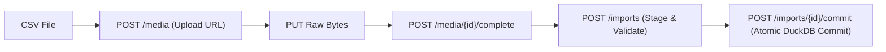
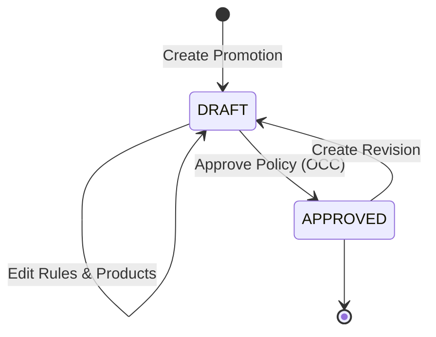
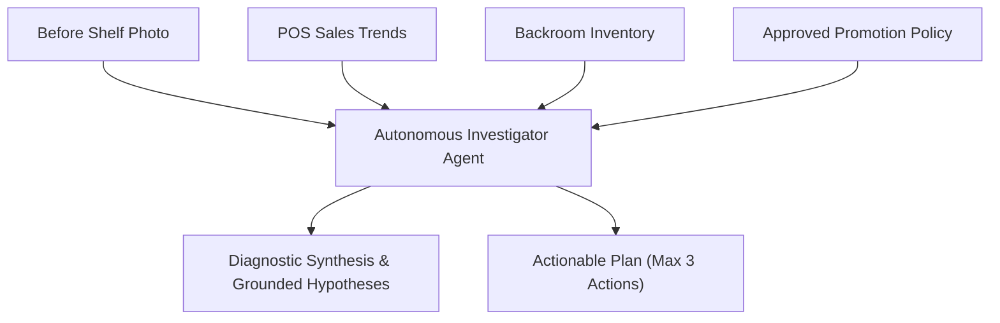

# StoreOps: End-to-End Operator & User Guide

StoreOps is an autonomous retail operations intelligence platform. It fuses daily sales transactions, backroom stock telemetry, vendor trade agreements, and computer vision from mobile shelf photographs to diagnose inventory execution failures and verify merchandising compliance.

---

## 1. System Roles & Access Control

StoreOps enforces strict role-based access control (RBAC) and multi-tenant workspace isolation across all API endpoints and Web UI routes:

| Role | Intended Persona | Key Permissions & Responsibilities |
| :--- | :--- | :--- |
| **`ADMIN`** | Operations Lead, Trade Merchandising Manager | • Manages catalog master data (stores, distributor hubs, SKUs). • Uploads, stages, validates, and commits daily sales/inventory CSVs. • Authors, edits, and approves promotional policy rules. • Invites/onboards workspace members and assigns roles. |
| **`REP`** | Field Sales Representative, Shelf Auditor | • Conducts in-store visits and audits. • Captures and uploads shelf before-and-after photographs. • Initiates autonomous AI investigations and reviews hypotheses. • Accepts remedial action plans and claims work completion. • Triggers visual execution verification and accesses audit reports. |

---

## 2. Master Catalog & Telemetry Ingestion (ADMIN)

### 2.1 Catalog Hierarchy Setup
The operational foundation requires configuring the retail network:
1. **Distributor Locations**: Regional fulfillment hubs supplying retail stores (e.g., `LOC-DIST-01`).
2. **Retail Stores**: Physical storefronts with assigned format (`SUPERMARKET`, `HYPERMARKET`, `CONVENIENCE`), region, timezone, and linked distributor hub. Each store automatically maintains an associated backroom storage location (`<STORE_CODE>-BACKROOM`).
3. **Products & SKUs**: Product catalog items with SKU identifier, description, and `case_units` packaging factor.

### 2.2 CSV Telemetry Ingestion
Daily operational data is ingested via an asynchronous, two-phase staging and commit pipeline:

#### Ingestion Error Handling & Concurrency:
- **Foreign Key Validation**: If an imported CSV contains unknown SKUs or stores, the import fails during validation with `status: FAILED` and detailed error descriptors. Zero rows are committed.
- **Idempotency & Retries**: Staging and commit operations accept an `Idempotency-Key` header. Exact retries replay the HTTP response without duplicate rows.
- **Optimistic Concurrency Control (OCC)**: Commits require `expected_version: 1`. Concurrent commit attempts return `409 Conflict`.

---

## 3. Merchandising Policy Administration (ADMIN)

Trade agreements between beverage brands and retail partners define contractual shelf placement obligations.

### 3.1 Policy Lifecycle

### 3.2 Rule Types & Grounding
When approving a promotional agreement, admins define structured rules:
- **`MIN_FACINGS`**: Contractual minimum number of horizontal facing units on the shelf (e.g., ≥ 3 facings of Sparkling Water 500ml).
- **`FACING_SHARE`**: Minimum percentage of the category shelf allocated to the brand.
- **`EYE_LEVEL`**: Requirement for placement on prime middle shelves (eye/touch level).
- **Policy Grounding**: Each rule records its provenance (`source.kind`: `EXTRACTED` or `MANUAL`), referencing page numbers, textual quotes, and reviewer notes.

---

## 4. In-Store Audit & Autonomous Investigation (REP)

### 4.1 Starting a Visit & Capturing Evidence
1. A field rep arrives at a retail store and initiates a visit via the mobile web client: `POST /visits`.
2. The rep captures a baseline "before" photo of the promotional shelf display.
3. The image is uploaded securely:
   - Client strips EXIF metadata and normalizes orientation automatically.
   - Images are validated: ≤ 5 MB byte size, ≤ 2,048 px long edge.
   - The media is tagged with `kind: "VISIT_BEFORE"`, `store_id`, `zone_id`, and UTC timestamp.

### 4.2 Autonomous Diagnostic Synthesis
The rep initiates an investigation: `POST /investigations`. StoreOps triggers an autonomous AI investigation agent that synthesizes multiple data sources:

The investigation agent:
1. Cross-references observed shelf facings against the approved policy rule.
2. Checks POS velocity: If sales dropped to zero while backroom stock exists, the problem is shelf restocking rather than distribution stockout.
3. Formulates grounded hypotheses citing evidence IDs and historical baseline figures.
4. Generates an actionable remediation plan constrained to **at most 3 prioritized actions** (e.g., "Restock 2 cases of Spring Water from backroom aisle B2 to front endcap").

---

## 5. Remediation & Visual Execution Verification (REP)

### 5.1 Accepting Plans and Claiming Work
1. The rep reviews the investigation findings in the mobile interface.
2. The rep accepts the plan: `POST /investigations/{id}/accept`.
3. The rep executes the physical restocking in the store.
4. The rep marks the action as completed: `PATCH /investigations/{id}/actions/{action_id}` with `status: "CLAIMED_DONE"`.
   > *Security Note: Field reps cannot mark actions as `VERIFIED`. Only the multimodal verification engine can grant verified status upon reviewing photographic proof.*

### 5.2 Multimodal Execution Verification
1. The rep captures an "after" photo of the remediated shelf.
2. The photo is uploaded as `kind: "VISIT_AFTER"`.
3. The system enforces strict media eligibility checks:
   - **Reused Image Rejection**: Submitting the same image (or normalized visual hash) as the before-photo is rejected with `422 REUSED_BEFORE_MEDIA`.
   - **Timestamp Freshness**: After-images captured > 30 minutes in the past or > 5 minutes in the future are rejected.
   - **Policy Staleness Check**: If the promotional policy was modified during the visit, verification is fenced with `409 STALE_POLICY`.
4. The rep requests verification: `POST /investigations/{id}/verify`.

### 5.3 Aggregate Derivation & Atomic Closure
The verification agent inspects the after-photo and evaluates rule compliance:
- **`PASS`**: All contractual rules are visually verified. The actions transition to `VERIFIED`, the visit status transitions to `CLOSED`, and a permanent audit report is generated.
- **`FAIL`**: Non-compliance detected (e.g., wrong SKU stocked, facing count still insufficient). Actions remain unverified, visit remains `OPEN`, and investigation is marked `NEEDS_WORK`.
- **`INCONCLUSIVE`**: Image glare, blur, or severe obstruction prevents confident verification. Prompts rep for a clearer angle.

---

## 6. Audit Reports & Executive Visibility

Upon successful verification, StoreOps generates an immutable audit report (`GET /reports/{id}`):
- Summary of initial audit findings and identified root causes.
- Side-by-side photographic comparison with bounding citations.
- Complete chronological audit log with immutable timestamps and user identifiers.
- Printable summary formatted for export and retailer joint-business reviews.

---

## 7. Mobile Ergonomics & Anti-Fabrication Guarantees

StoreOps is designed specifically for field conditions:
- **Responsive 375px Viewport**: Tested and optimized for single-handed mobile smartphone use on retail floors.
- **Honest Empty States**: When data is missing, the system never displays fabricated estimates or placeholder metrics. It renders explicit labels: *"No sales data"*, *"Stock unknown"*, *"Insufficient comparison data"*.
- **Optimistic Concurrency Protection**: Any concurrent update to a visit or action triggers a `409 Conflict` warning modal with a one-click refresh option to preserve operator work.
