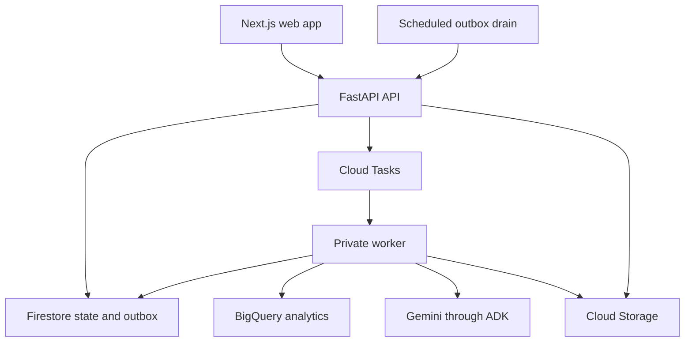

# Architecture and module boundaries

## Runtime topology

The browser uses Firebase Auth and sends a Firebase ID token to the API. Browser code
cannot query Firestore, BigQuery or Gemini directly. The API authorizes resource access,
validates requests and returns application DTOs. X-Workspace-Id selects a membership-checked context; it is never trusted as authorization. Expensive operations return HTTP 202
with a persistent Job. The UI polls jobs and their ordered events; streaming is optional
after the MVP. A browser disconnect never owns or cancels the worker's lifetime.

Cloud Tasks delivers work at least once, so application idempotency is mandatory. It
does not guarantee dispatch latency. Treat investigations as resumable asynchronous
jobs, show queued time, and measure queue delay separately from processing time.

## Persistence and commit boundaries

Firestore is authoritative for identities/membership, catalog, policies, visits,
media metadata, investigations, actions, jobs and evidence. BigQuery is authoritative
for committed sales/inventory revisions and import manifests. Cloud Storage retains
immutable media and original imports. Firestore mirrors import progress; a reconciliation
step repairs that mirror if BigQuery committed before a worker crashed.

An import's facts and BigQuery manifest are committed in one BigQuery transaction after
staging/validation. A model call never performs a business mutation. Mutating services
make checked writes after validation and, when required, human acceptance.

## Required ports

Define these Python Protocol interfaces in T01. Domain/services depend on them; route
handlers and AI modules must not instantiate SDK clients themselves.

| Port | Required behavior |
|---|---|
| IdentityVerifier | Verify token and resolve uid; local emulator support; no cloud bypass |
| StateRepository | Authorized entity reads/writes, transactions, expected-version checks, job leases and event append |
| AnalyticsRepository | Validate/commit imports; retrieve sales/stock at a frozen set of committed batch IDs; parameterized metrics queries |
| BlobRepository | Prepare upload, inspect bytes, finalize immutable asset, read bytes and issue expiring download URL |
| JobDispatcher | Enqueue a job ID; tolerate duplicate deliveries and recover an outbox entry |
| ModelGateway | Structured image/PDF/text inference with explicit model/config, schema validation, usage and request metadata |
| Clock | UTC now plus store-local date conversion; injectable in tests, never browser-controlled in production |
| IdFactory | Opaque UUID generation; injectable deterministic IDs only in tests |

Specify method signatures in code from the public and AI contracts, then freeze them
before parallel implementation. A new port method is a coordinated contract change.

## Local and cloud profiles

| Capability | Local development | Cloud MVP |
|---|---|---|
| Identity and state | Firebase Auth and Firestore emulators | Firebase Auth and Firestore |
| Commercial queries | DuckDB adapter behind AnalyticsRepository | BigQuery adapter with identical semantics |
| Media | Local filesystem adapter with HTTP upload/download | Private Cloud Storage objects with signed URLs |
| Dispatch | Local worker polling the same persisted jobs/outbox | Cloud Tasks with OIDC to a private Cloud Run worker |
| AI | Explicit stub mode or live Gemini credentials | Live Gemini only; refuse startup with stub mode |

Local mode must be visibly labeled, including whether AI is stubbed. It is useful for
deterministic development, not a production substitute. Run analytics adapter parity
tests against a disposable BigQuery dataset before release. Do not claim that DuckDB
tests establish BigQuery correctness.

## Configuration and deployment

Use separate Cloud Run web, API and worker services. Keep the worker private. Scheduled
outbox draining may call an IAM-protected API route once per minute. Configuration
includes APP_ENV, workspace bootstrap settings, Firebase project, data region, bucket,
dataset, queue, MODEL_ID, thinking level, per-run token/call limits and daily quotas.
No cloud secrets belong in web bundles or repository files.

Primary model is `gemini-3.8-flash`, initially MEDIUM thinking. Compare HIGH for
investigation and LOW for extraction on development cases; MINIMAL is unsupported.
Use the global model endpoint; do not claim Singapore-only inference. Prefer
asia-southeast1 for the application's regional services where available. Keep
`gemini-3.5-flash` as an optional fallback only after separate acceptance; any switch
creates a new labeled attempt rather than mixing models in an existing run.

T00 pins a supported Node LTS, Python runtime and exact dependency versions with lockfiles.
Do not freeze obsolete versions merely because an earlier example used them. Confirm
actual project model access and quota before treating the live gates as unblocked.
See [sources](../SOURCES.md) for the provider documentation used in this decision.
