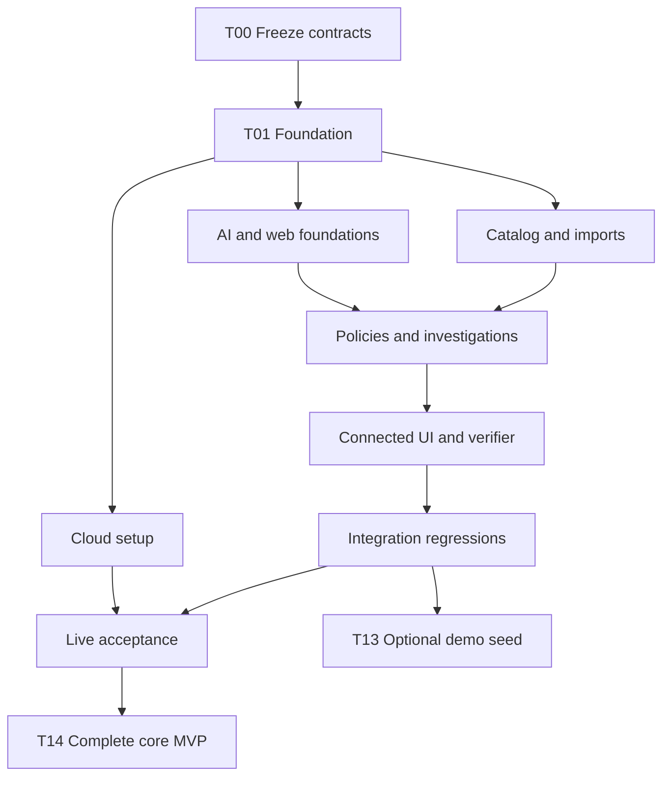

# Iterative and parallel agent development

## Sequence

The build combines contract-first boundaries with vertical integration gates. It does
not assign a whole frontend and backend to isolated agents and hope they connect later.
One coordinator owns integration, task state and shared contracts. Specialists implement
bounded modules in their own branches/worktrees and deliver evidence at each wave.

| Wave | Ready tasks | Integration result |
|---|---|---|
| 0 | T00 | Contracts, shared interfaces and versions frozen |
| 1 | T01 | Empty authenticated app, persistence and job skeleton |
| 2 | T02, T03, T05, T06, T11 | Independent catalog/import, web, model and cloud work; contract doubles allowed in module tests |
| 3 | T04, T07 | Reviewed policies and persisted-input investigations |
| 4 | T08, T09 | Connected full UI and verification backend; integrate together |
| 5 | T10 | Complete deterministic regression, concurrency and failure behavior |
| 6 | T12 and optional T13 | Live/cloud acceptance; optional demo data remains independent |
| 7 | T14 | Fresh empty deployment accepted and handover complete |

Actual readiness uses the dependency DAG in plan/tasks.json. If fewer agents are available,
run ready tasks sequentially. Do not start a dependent task against an unreviewed interface
and then claim it is integrated. Up to five specialists plus a coordinator is sufficient;
more agents are not a goal.

## Ownership and contract changes

Task owned_paths define edit boundaries. The coordinator alone edits root contracts,
dependency lockfiles and application composition roots once frozen. Specialists submit
registration/migration/contract requests in their handoff; the coordinator applies the
small integration change. A task must not create a second auth/client/state abstraction
because another owner's implementation is not yet merged.

If a contract must change, record the reason, affected operation/schema, migration or
compatibility effect, dependent tasks and updated tests. Increment contract version for
breaking changes and regenerate both client/server artifacts before resuming dependents.
No work starts from a silently modified shared contract.

## Each task is a testable packet

Use prompts/task-agent.md with exactly one task ID. The agent reads the required specs,
implements its acceptance cases and returns a diff, tests and a structured handoff.
Use prompts/reviewer.md for an independent review when available. The coordinator runs
the combined branch's checks; tests on an isolated branch do not certify integration.

After every wave, demonstrate the new user-visible capability with fresh test records.
An incomplete local adapter or stubbed provider must be identified. Do not spend a week
polishing disconnected screens before the first real persistence/investigation slice.
